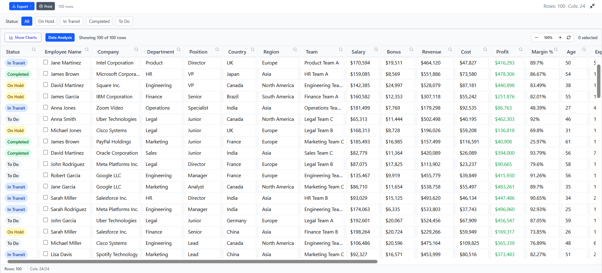
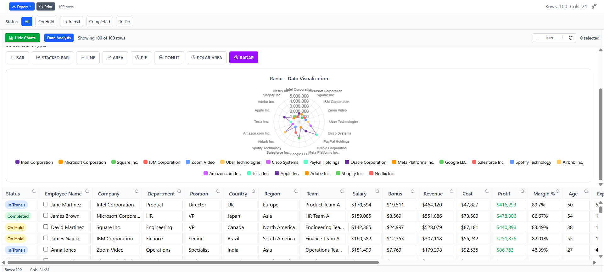
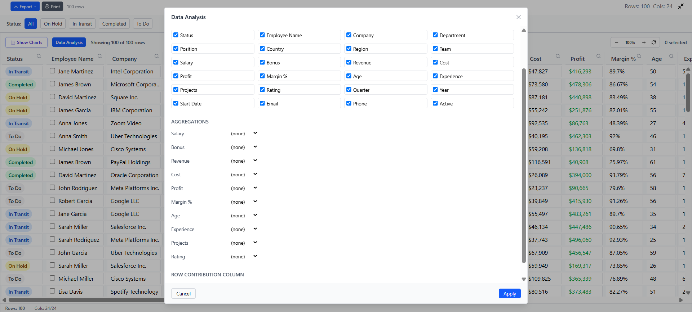

# Style Grid

A modern, free, open-source React + TypeScript data grid inspired by AG Grid. Built from scratch by me to replicate as many powerful enterprise features as possible—without the license cost. It's still a work in progress, but already usable for rich data-heavy interfaces.

> Status: Currently a static project (not yet published to npm). The goal is to release it as an installable package / simple API so anyone can drop it into their project.

## Why Style Grid?
I wanted a fully featured grid (pivoting, grouping, filtering, exports, etc.) without paywalls. Rebuilding this was hard and still evolving, but the foundation is solid and extendable.

## Core Features (Implemented)
- Column resize, reorder, hide/show, pin left/right
- Sorting (single & multi)
- Text / number / date / set filters
- Row selection (single & multi with checkboxes)
- Grouping & pivot mode (drag & drop style configs)
- Aggregations (sum, avg, count, min, max)
- Virtual scrolling for large datasets
- CSV / basic Excel-style export
- Context menu, status bar, sidebar tools
- Keyboard navigation & custom cell rendering

## Roadmap / In Progress
- Packaging to npm (import like: `import { StyleGrid } from 'style-grid'`)
- Public API docs & examples site
- More export formats & customization hooks
- Theming system and dark mode polish
- Better accessibility + test coverage
- Performance tuning for 50k+ rows

## Quick Start (Current Repo)
```bash
git clone <your-fork-or-repo-url>
cd style-grid
npm install
npm run dev
```

## Minimal Usage Example
```tsx
import { GridProvider } from './context/GridContext';
import { DataGridContent } from './components/DataGridContent';
import { generateMockData, mockColumnDefs } from './data/mockData';

export function App() {
  const rowData = generateMockData(500);
  return (
    <GridProvider options={{ columnDefs: mockColumnDefs, rowData }}>
      <DataGridContent className="h-[600px]" />
    </GridProvider>
  );
}
```

## Screenshots
| Grid | Charts Panel | Data Analysis |
|------|--------------|---------------|
|  |  |  |

## Contributing
Not formal yet—open issues / ideas are welcome. Soon: guidelines + extension points.

## License
MIT – free for commercial & personal use.

## Author / Contact
Created by **Samarth A K**  
Email: **esrsamarth@gmail.com**

<div align="center" style="margin-top:32px;">
  <hr />
  <p><strong>Built with ❤️ using React, TypeScript, Vite & Tailwind CSS</strong></p>
  <blockquote style="font-style:italic; opacity:0.85;">
    “Free, open, and powerful. Style Grid exists so you don't have to choose between features and freedom.”
  </blockquote>
</div>
